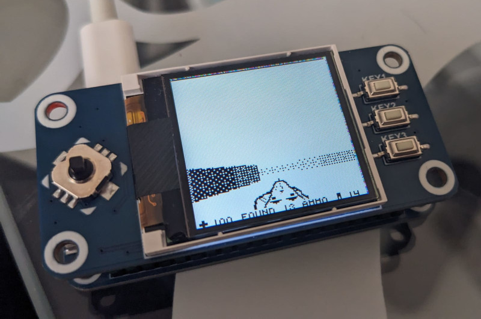

# RP2040 Doom

try to port the game Doom to the RP2040 using the Waveshare
rp2040 pi zero and the waveshare 128x128 st7789 LCD display.

## Tiny Doom

The first example is based on Doom Pico (a port of Doom
Nano) from [Gualor](https://github.com/Gualor/doom-pico).

